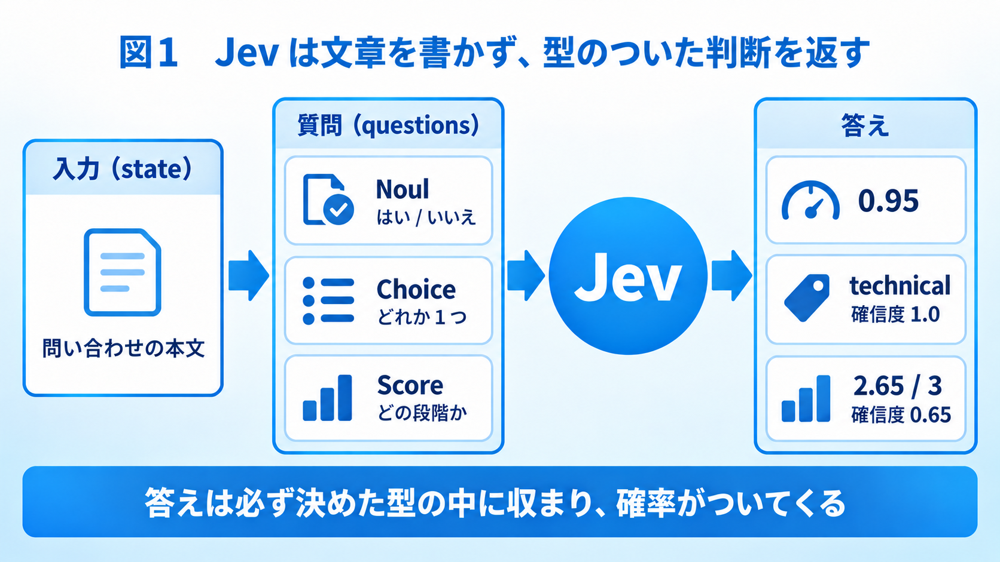
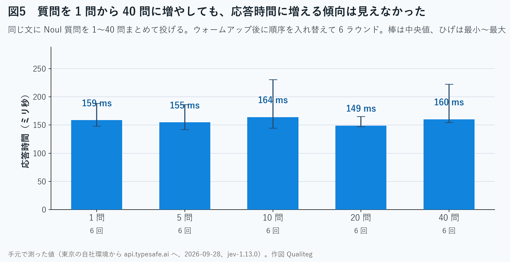
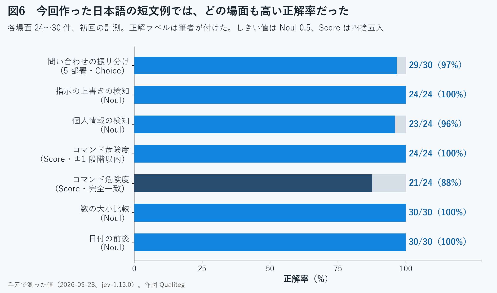
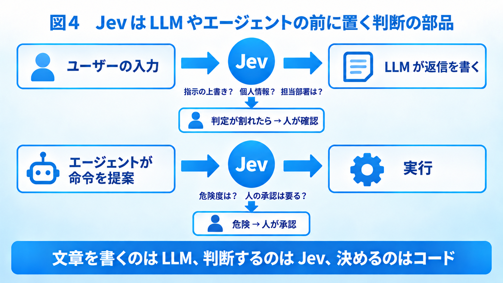

# jev-typesafe-demo

Sample code for the Qualiteg Blog article
**「Jev の特徴とその実力 ～ 301 回 API を呼んで確かめてみた」**
(https://blog.qualiteg.com/jev-typesafe-ai-pricing-python-hands-on/).

Jev is TypeSafe AI's "System One" model. It does not generate text. You send a piece of text (`state`) and a set of typed questions (`Noul` / `Choice` / `Score`), and it returns typed answers with calibrated probabilities.



This repository contains the exact scripts used in the article, plus the raw responses (`results/*.jsonl`) so that every number in the article can be traced back to an API call.

## What is measured

All numbers below were measured on 2026-09-28 from Tokyo against `api.typesafe.ai`, model `jev-1.13.0`, with the official Python SDK (`typesafe-sdk` 0.7.2). Ground-truth labels for the small Japanese datasets were written by the author.

| Script | Scenario | Result |
|---|---|---|
| `02_routing.py` | Route 30 Japanese support tickets to 5 departments (`Choice`) | 29/30 correct. The one miss had the lowest confidence of all (0.38) |
| `03_guardrail.py` | Detect prompt-injection and PII in 24 inputs (`Noul` x2) | injection 24/24, PII 23/24 (8 PII cases: 7 detected, 0 false positives) |
| `03b_guardrail_retest.py` | Same 24 inputs after adding "bank account number" to the PII question | injection 24/24, PII 24/24; the missed case went from 0.45 to 0.97 |
| `04_agent_gate.py` | Score the risk of 24 shell commands on a 0-3 scale (`Score`) + "needs human approval?" (`Noul`) | exact 21/24, within one level 24/24 |
| `05_latency.py` | 1 / 5 / 10 / 20 / 40 questions in one request, 5 runs each in that order; then 80 requests at concurrency 8 | median 211 / 176 / 197 / 162 / 152 ms; 41.4 req/s over a 1.93 s window, p95 227 ms |
| `05b_latency_shuffled.py` | Same, after 3 warm-up calls, question counts shuffled per round, 6 rounds | median 159 / 155 / 164 / 149 / 160 ms |
| `06_weak_spots.py` | Number comparison and date ordering in Japanese, 30 each | 30/30 and 30/30 |
| `07_cost.py` | Sum `usage.input_tokens` from `results/*.jsonl` | 218 logged requests, 109,338 input tokens, $0.00459. Adding the 80 concurrent requests and 3 unlogged warm-up calls: 301 requests, an estimated 156,070 input tokens (the 3 warm-up calls were not logged and are counted as 484 tokens each), about $0.00655 (estimated from usage and the published price, not a billed amount) |







## Run it yourself

You need a TypeSafe account with credit (as of 2026-09-28 new signups get no free credit; the article used a $10 purchase). Create an API key in the console and put it in an environment variable. Nothing in this repository contains a key.

```powershell
git clone https://github.com/qualiteg/jev-typesafe-demo.git
cd jev-typesafe-demo
pip install -r requirements.txt
$env:TYPESAFE_API_KEY = "your key"
$env:PYTHONIOENCODING = "utf-8"   # Windows: otherwise Japanese legend strings look garbled in the console
python 01_hello.py
python 02_routing.py
python 03_guardrail.py
python 04_agent_gate.py
python 05_latency.py
python 06_weak_spots.py
python 07_cost.py
```

Every call goes through `jev_common.call()`, which appends the raw response and the elapsed time to `results/<script>.jsonl`. The `results/` directory in this repository holds the runs used in the article; running the scripts again appends to those files, so delete them first if you want a clean comparison.

Cost of running everything once is well under one US cent (input $0.042 per million tokens, output free, as published by TypeSafe AI).

## Files

| File | Purpose |
|---|---|
| `jev_common.py` | Client from `TYPESAFE_API_KEY`, timed `call()`, JSONL logging, cost helper |
| `01_hello.py` | One Japanese ticket, all three question types, prints the raw JSON |
| `02_routing.py` | 30 tickets, 5 departments, accuracy / confidence / latency |
| `03_guardrail.py` | 24 inputs, prompt-injection and PII detection |
| `04_agent_gate.py` | 24 shell commands, 4-level risk score and "needs human" |
| `05_latency.py` | Latency vs. number of questions; throughput at concurrency 8 |
| `05b_latency_shuffled.py` | Latency vs. number of questions, warmed up and shuffled |
| `03b_guardrail_retest.py` | PII re-test with an extended question |
| `06_weak_spots.py` | Number comparison and date ordering (documented weak spots) |
| `07_cost.py` | Aggregates token usage into a cost table |
| `results/` | Raw responses used in the article |
| `images/` | Figures from the article |

## Sources

- TypeSafe AI, "Introducing System One Models and Jev": https://typesafe.ai/blog/introducing-system-one-models-and-jev
- TypeSafe AI docs, Models: https://docs.typesafe.ai/models
- TypeSafe AI docs, Python SDK usage: https://docs.typesafe.ai/sdk/python/usage
- TypeSafe AI docs, Jev 1.13 jaggedness: https://docs.typesafe.ai/model-jaggedness/jev-1.13

## License

MIT
